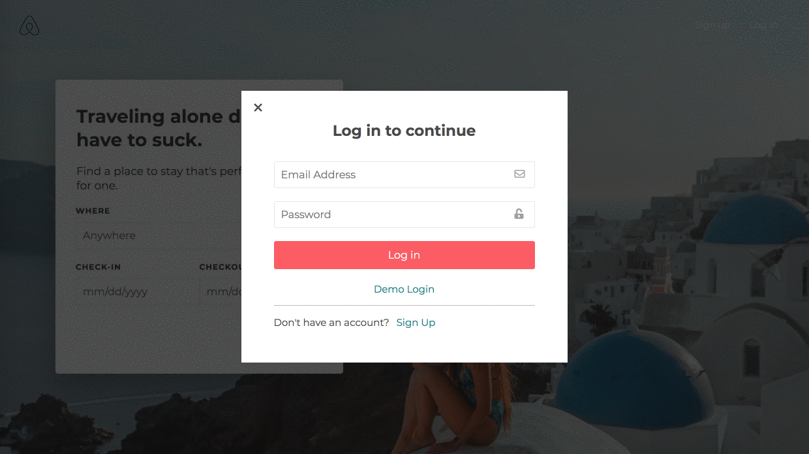

# SoloBnB

### [Visit the live site](https://solobnb.herokuapp.com/#/)

SoloBnB is a single-page, full-stack web application modeled after Airbnb and geared toward solo travelers. It uses Ruby on Rails with a PostgresSQL database on the back-end, and React.js and Redux on the front-end. For image hosting, it utilizes Amazon Web Services. For live messaging, it uses Action Cable to integrate WebSockets with the rest of the Rails application.

## Why solo travel?

It started entirely by accident. I was 14 years old, and like most 14-year-olds, I was restless. I had a mind full of grand visions and an undeterred spirit that had not yet known the crushing bite of failure. All I knew was that I had spent my entire life in New York and I wanted to see things I had never seen before, like stars peppering the night sky and vast expanses of desolate nature where not a single skyscraper dominated the landscape. 

So I applied for a study abroad grant from my high school and I spent my summer learning Latin in a small village in Italy, practicing French in Paris, and honing my writing skills at Oxford University. But at the end, it wasn't the hours of practicing conjugations in dusty attics that stuck with me but rather the wild Vespa rides across the Italian countryside, the opulence of Versailles, and the lazy afternoons punting on the river Cherwell that stayed forever ingrained in my memory. 

For the first time in my life, I saw the stars. And I knew, in that moment, that I never wanted to stop chasing them.

Years — and dozens of countries — later, much has remained the same. And while there is nothing sweeter than sharing a vacation with friends or family, I still believe that there is something about solo travel that changes you fundamentally. Would I be the same person today if I hadn’t plunged myself into the icy dark sea and slept on the beach with strangers who would go on to become some of my closest friends, or wept alone for six hours straight on the flight home from Chile, or climbed into a magnificent glowworm cave in Australia at the dead of night, or recovered from dengue fever in a hospital room all by myself in the Philippines? Those moments of unmeasurable joy and pain — moments that felt like years — remind me today of all that I am capable of.

And so, SoloBnB is not just a travel booking application. It's also an ode to the life-changing experiences we have when we're on the road by ourselves.

## Technologies

* React / Redux
* Ruby on Rails
* PostgreSQL
* Javascript
* CSS
* Webpack
* Amazon Web Services
* Google Maps API
* Action Cable

## Key features
#### [SoloBnB Design Documents](https://github.com/nian-hu/solobnb/wiki)

#### User Authentication

* Users can sign up or log in with an existing account.
* Invalid login or signup attempts would trigger both front-end and back-end errors.
* Logged in users can access features such as making reservations, accessing host profiles, and messaging hosts.
* Only logged out users can view the splash page. Logged in users are redirected to the listing index page.

#### Listings + Search
* Listings are shown according to the position of the map. As users zoom out and move around, more listings are displayed.
* Users are able to search for listings with Google Maps Places API, namely the Autocomplete widget.
* Users can filter listings based on availability by selecting a date range on the splash page. Unavailable listings will not be displayed.
* Every listing comes with a short text description, location information, a section for amenities with modal functionality to view more, host information, availability information, reviews, and a map displaying the neighborhood.

#### Bookings
* Users are able to book listings for a given date range. If the listing is unavailable during those dates, users will not be permitted to select those dates.
* Users are able to access their own bookings under the "Trips" section of the navigational bar dropdown.
* Users are only able to cancel bookings if the start date has not yet occurred.
* Users are only able to write reviews for bookings if the end date has already passed.

### Reviews
* Users are able to write reviews for past bookings and also provide ratings in the form of stars, from one to five.
* Users are able to rate bookings across six categories — accuracy, communication, cleanliness, location, check-in, and value.
* Listings display an overall average rating that is recalculated every time a new rating is submitted.
* Listings also display an average rating for each of the six categories. Each category rating is also recalculated every time a new rating is submitted.

#### User Profiles + Messaging
* Users are able to access their own profile under the "Profile" section of the navigational bar dropdown.
* Users can visit a host's profile by clicking on the host's name on the listing page.
* Profiles display a short text description as well as the user's listings. If the user has no listings, it will say that the user has no listings at this time.
* Users are able to send live messages to each other with a button accessible on every user's profile page.
